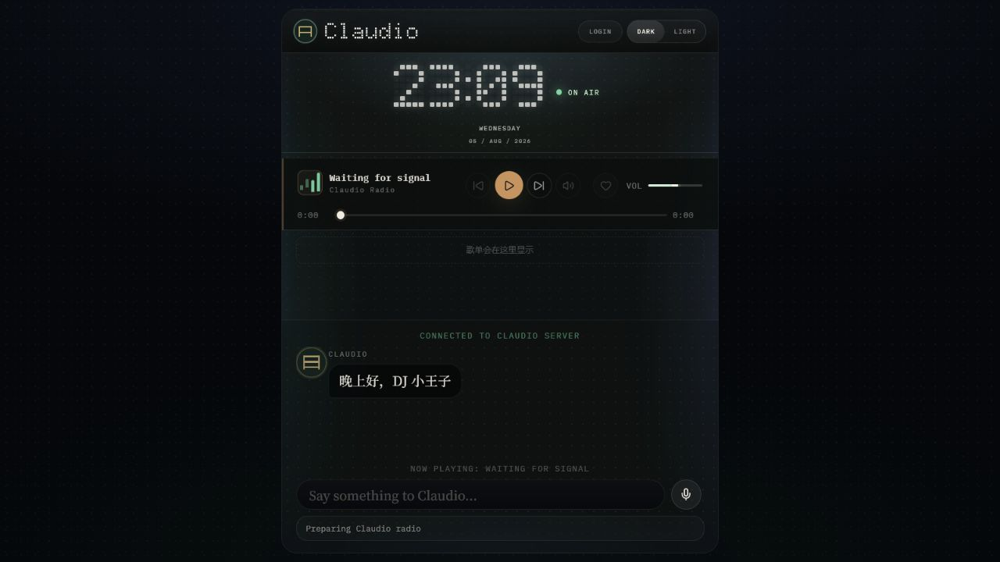
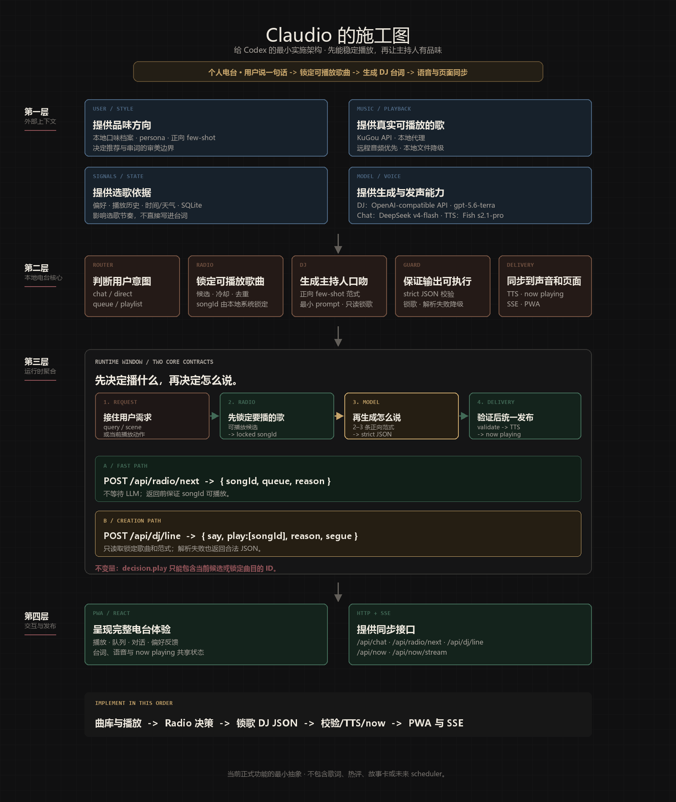

# Claudio

> 你的情绪和所在的地方，就是我的提示词。我讨厌算法。我有自己的品味。

本地决策优先、通过大模型 API 理解与表达的个人 AI 电台。它把一句自然语言需求变成一首真实可播放的歌和一段可播出的 DJ 台词。

<p align="center">
  
</p>

Claudio 把两件事分开处理：本地系统负责选歌、队列和播放可用性；通过大模型 API 调用的模型只负责理解、品味与表达。这样模型失效时，电台仍能继续播放；模型工作时，主持人也不会越权改歌。

## 它解决什么问题

普通播放器会给你歌单，普通聊天机器人会给你一段话。Claudio 想做的是两者之间的那一段：你说“下雨天想听点有节奏但不吵的歌”，它先从可播放曲库选出下一首，再为这首歌写一句可以念出来的开场。

它不是“让 LLM 随便推荐一首歌”的 Demo。歌曲必须存在、可播放、经过冷却和去重；DJ 决策的核心字段必须绑定已锁定的歌曲，并使用固定 JSON contract。

## 主要功能

- 用自然语言点歌、插队、请求下一首或生成场景歌单。
- 自动 Radio 默认从已同步的 KuGou API 曲库中选择可验证的播放源；`MUSIC_LIBRARY_DIR` 可用于本地曲目扫描与直接播放。
- 根据偏好、近期播放与时间调整选歌节奏，并保留天气、日历等环境信息作为可选上下文。
- 由大模型 API 从正向范式库中选择与当前歌曲匹配的参考片段，再创作 DJ 台词；范式可按自己的审美在 `prompts/dj-fewshot.md` 中编写或替换。
- 使用 Fish Audio 合成语音；不可用时仍保留文字台词，并返回浏览器回退标记。
- 通过 React + Vite Web App、REST 与 SSE 让歌曲、台词、语音和页面状态保持一致。

## 架构

<p align="center">
  
</p>

> 这张图展示产品级边界与数据流；具体可用能力、接口字段和可选依赖以本文后面的配置与 API 示例为准。当前项目是 React + Vite Web App，不把 PWA 安装能力作为前置条件。

核心边界只有三条：

1. 本地系统先选择并锁定 `songId`，模型不能自行换歌。
2. DJ 写作通过大模型 API，只读取人设、正向范式与当前锁定歌曲；它从 `prompts/dj-fewshot.md` 选择匹配的参考片段，再写作，不把未经整理的环境和历史数据直接塞进 prompt。
3. 模型决策使用 `{ say, play, reason, segue }` 的严格 JSON contract；选歌可走规则路径，TTS 失败时保留文字台词和页面状态。

## 快速开始

### 前置条件

- Node.js 22.19.0 或更高版本
- 一个可用的 KuGou-compatible 服务与可访问的 KuGou 曲库（自动 Radio 的默认播放路径）
- 可选：OpenAI-compatible 或 DeepSeek 大模型 API Key，用于模型辅助的意图理解与 DJ 串词
- 可选：Fish Audio API Key；`MUSIC_LIBRARY_DIR` 可用于本地曲目扫描与直接播放

```powershell
git clone https://github.com/89630618/claudio-radio-wanfeng.git
cd claudio-radio-wanfeng
Copy-Item .env.example .env
npm ci
npm run dev
```

打开 `http://localhost:5173`。前端默认连接 `http://localhost:3080`。

macOS / Linux 使用：

```bash
git clone https://github.com/89630618/claudio-radio-wanfeng.git
cd claudio-radio-wanfeng
cp .env.example .env
npm ci
npm run dev
```

## 配置

所有密钥都只放在本地 `.env`；这个文件已被 Git 忽略，不能提交。

| 配置 | 用途 |
| --- | --- |
| `MUSIC_LIBRARY_DIR` | 可选，本地曲目扫描与直接播放目录；自动 Radio 仍以可验证的 KuGou 播放源为准 |
| `USER_PROFILE_DIR` | 本地口味、反馈和访谈数据目录，默认 `.data/user` |
| `KUGOU_API_BASE_URL` | KuGou API 服务地址 |
| `AI_API_KEY`、`AI_MODEL` | 默认模型与 API Key |
| `DJ_AI_MODEL` | DJ 串词模型，可单独覆盖 |
| `CHAT_AI_API_KEY`、`CHAT_AI_MODEL` | 对话模型兼容字段；当前聊天调用沿用通用模型配置 |
| `FISH_TTS_API_KEY`、`FISH_TTS_VOICE_ID` | Fish Audio 语音配置 |

`.env.example` 提供字段模板，其中 `AI_BASE_URL` 只是 OpenAI-compatible endpoint 示例。自动 Radio 默认使用 KuGou API；模型供应商、兼容 endpoint 和 API Key 由部署者自行选择。未配置模型时，模型辅助能力不可用，但规则选歌路径仍可运行。`MUSIC_LIBRARY_DIR` 留空时不会影响 KuGou API 选歌。

DJ 串词的正向范式库位于 `prompts/dj-fewshot.md`。它不是平台抓取内容，而是你为 Claudio 准备的写作参考：可保留、增删或重写成符合自己审美与节目气质的文本。每次生成时，大模型 API 会从中挑选最适合当前歌曲的参考片段。

首次运行时，Claudio 会在 `.data/user` 创建空白的口味档案。这里以及 `.data` 中的播放记录、KuGou 会话、TTS 缓存都属于个人运行数据，不会进入 Git。启用模型或天气请求时，必要字段会按配置发送给对应的第三方服务；本地保存与第三方调用是两个边界。

Claudio 的界面头像作为产品资源随仓库提供；音乐文件、账号会话与 API 凭据仍由部署者自行管理，不随项目运行数据进入 Git。

## 安全与内容边界

- 服务默认只监听 `127.0.0.1`。不要将开发服务器、`.data` 或带有账号会话的实例直接暴露到公网。
- 仓库不包含音乐文件或完整歌词库，也不包含平台账号、Cookie 或播放历史。Prompt 示例、头像、第三方依赖和平台服务可能有各自的来源与许可边界；部署者需自行取得合法的 KuGou 平台访问权限、音乐来源与模型 API 凭据。
- KuGou-compatible 服务是可替换的外部依赖；请自行审查其许可证、固定版本和平台条款。`scripts/setup-kugou-api.ps1` 固定到已审查提交 `06560e3e053bda1ab830750db6f645bab703f824`，不会自动追随上游最新代码。项目不会提供共享账号或公共音频转发服务。

## 使用方式

在输入框直接说出场景或动作，例如：

```text
下雨天想听点有节奏但不吵的歌
播放 The xx - Intro
把下一首插进队列
给我一份今晚写代码的歌单
```

系统会先返回可播放的歌曲，再生成与该歌曲绑定的 DJ 台词。偏好与近期播放参与选歌；天气和日历是否进入具体流程由请求与界面状态决定，默认不进入台词正文。

## 输入与输出示例

请求下一首：

```bash
curl -X POST http://localhost:3080/api/radio/next \
  -H 'Content-Type: application/json' \
  -d '{"query":"下雨天想听点有节奏但不吵的歌"}'
```

返回值包含已锁定的歌曲 ID、选择原因与来源。字段会随运行数据变化：

```json
{
  "songId": "kugou-track-id",
  "djLine": "",
  "reason": "scene and preference match",
  "moodTags": ["weather"],
  "source": "rules"
}
```

为该歌曲生成主持人台词：

```bash
curl -X POST http://localhost:3080/api/dj/line \
  -H 'Content-Type: application/json' \
  -d '{"songId":"kugou-track-id","query":"下雨天想听点有节奏但不吵的歌"}'
```

接口返回运行信息与内部决策，核心 DJ 决策位于 `decision` 字段：

```json
{
  "songId": "kugou-track-id",
  "djLine": "用于 TTS 与字幕的 DJ 台词",
  "source": "ai",
  "usedLlm": true,
  "decision": {
    "say": "用于 TTS 与字幕的 DJ 台词",
    "play": ["kugou-track-id"],
    "reason": "仅供系统内部使用的推荐原因",
    "segue": "fade_in"
  }
}
```

## 开发与验证

```bash
npm run smoke
npm run build
```

DJ 质量脚本需要已配置的曲库与外部服务；可用命令和参数以 `package.json` 为准。

## 当前范围

Claudio 当前专注于“可靠播放 + 有品味的表达”。歌词、热评、故事卡、复杂 scheduler 与未经验证的外部资料不在正式 DJ 写作链路内。

## 许可证

项目自身代码、项目文档与明确标注为原创的随仓库材料采用 [Apache License 2.0](LICENSE)。第三方依赖、头像与字体等素材、音乐内容、平台服务和模型 API 不因本项目采用 Apache-2.0 而改变其各自的许可证或使用条款。

Copyright (c) 2026 89630618

## Static Showcase

`npm run build:showcase` creates a static, pre-generated radio build in `dist-showcase` with the planned public base path `/claudio-radio-wanfeng/`. For local review, run `npm run dev:showcase` and open `http://127.0.0.1:5176/claudio-radio-wanfeng/`.

The Showcase preserves the Claudio radio interface, player, queue, theme and narration controls. It deliberately excludes chat, KuGou login, local profile data, backend requests, API keys, LLM generation and Fish generation. Showcase music and narration are pre-generated static files; they are not covered automatically by this repository's Apache-2.0 license. Each published track must have an entry in `ASSET-LICENSES.md` and pass `npm run showcase:validate` before release.

The full local product remains the place for real-time generation, private configuration, personalization and local music workflows. The repository contains only a self-generated placeholder Showcase asset until cleared, public-web-hostable recordings and artwork are provided.

Claudio 是独立项目与虚构主持人名称，不隶属 Anthropic 或 Claude 产品。音乐、平台服务与模型 API 均为使用者自行配置的外部依赖。
